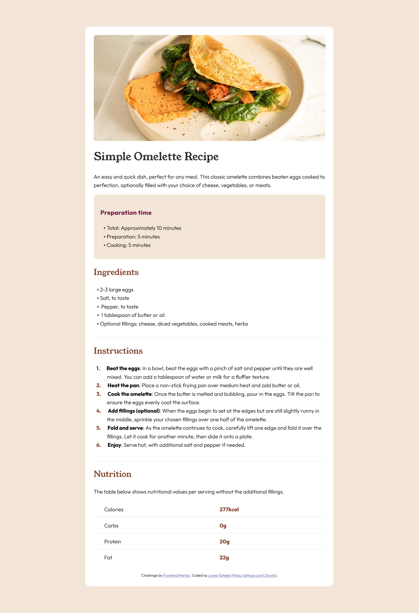
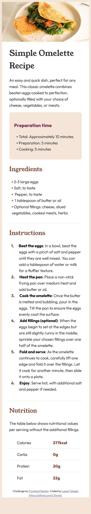

# Frontend Mentor - Recipe page solution

This is a solution to the [Recipe page challenge on Frontend Mentor](https://www.frontendmentor.io/challenges/recipe-page-KiTsR8QQKm). Frontend Mentor challenges help you improve your coding skills by building realistic projects. 

## Table of contents

- [Overview](#overview)
  - [The challenge](#the-challenge)
  - [Screenshot](#screenshot)
  - [Links](#links)
- [My process](#my-process)
  - [Built with](#built-with)
  - [What I learned](#what-i-learned)
  - [Continued development](#continued-development)
  - [Useful resources](#useful-resources)
- [Author](#author)
- [Acknowledgments](#acknowledgments)

**Note: Delete this note and update the table of contents based on what sections you keep.**

## Overview

### Screenshot




The above are the screenshots of my solution to the challenge.

### Links

- Solution URL: [Add solution URL here](https://your-solution-url.com)
- Live Site URL: [Add live site URL here](https://your-live-site-url.com)

## My process

### Built with

- Semantic HTML5 markup
- CSS custom properties


### What I learned

I learned how to insert more than one content to Psudo selector (::before) { content: '.' counter(li);}.
Also, I learn how to make (li) a counter, add color to list marker etc.


To see how you can add code snippets, see below:

```html
<h1>Some HTML code I'm proud of</h1>
```
```css
.proud-of-this-css {
  ol li::before{
    content: '.' counter(li);
    margin-right: 1.2em;
    text-align: right;
    direction: rtl;
    margin-left: -2em;
    font-weight: bold;
    display: inline-block;
    color:  hsl(14, 45%, 36%);
}
ol li {counter-increment: li}

li::marker{
    color: hsl(14, 45%, 36%);
    font-weight: bold;
    font-family: Outfit;
}
ol {
    list-style-type: none;
    counter-reset: li;
}
tbody > tr:last-child > td {
    border-bottom: 0;
}
}


### Continued development

Responsive Web Design is the area I will like to deleop more


### Useful resources

- [W3Schools](https://www.w3schools.com) - This helped me  with RWD. I really liked this pattern and will use it going forward.
- [Stack Overflow]](https://stackoverflow.com/questions/70927582/how-to-make-and-well-position-html-custom-list-marker) - This is an amazing article which helped me finally understand how to insert more than one content to Psudo selector (::before) { content: '.' counter(li);}.. I'd recommend it to anyone still learning this concept.
-[W3org] (https://www.w3org.com) - This helped me learn psudo element content.

## Author

- Website - [Lawal Toheeb Bayonle](https://github.com/LToyyib)
- Frontend Mentor - [@LToyyib](https://www.frontendmentor.io/profile/LToyyib)
- Twitter - [@Teeamir](https://twitter.com/Teeamir)
- Email  -[Gmail] (lawaltoheeb28@gmail.com)


## Acknowledgments

I really appreciate Frontend moentor for this challenge opportunity, which has helped to learn, unlearn, relearned and learning Web development.

